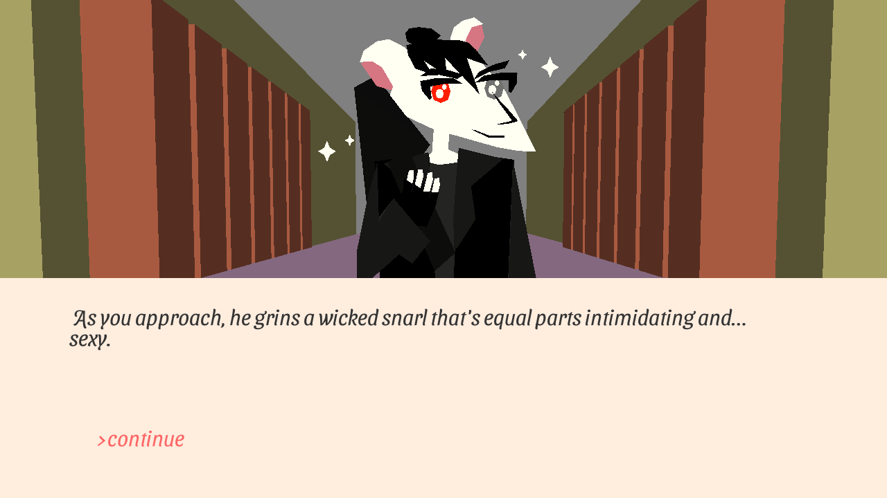

# Sewer Academy: A Rat Dating Simulator

Author: Alyssa Lee and Madeline Anthony

Design: You get to romance up to two rats. also theyre ~twins~ 

Text Drawing: The text is shaped using harfbuzz and rendered with freetype. Individual textures for each glyph are loaded the first time that glyph appears, then they are stored in a map. Most text rendering code followed [this tutorial](https://learnopengl.com/In-Practice/Text-Rendering) (thanks to hjamal for sharing!). Dialogue was created in a simple text file and stored/loaded using chunks. 

Screen Shot:

How To Play:
Use the enter/return key to advance. Choose between options with left and right arrow keys. 

Sources: 
Script by Madeline Anthony
Art by Alyssa Lee
"Relaxing Ballad" by Alexander Nakarada obtained via [freepd](https://freepd.com/upbeat.php)
"Abstract Anxiety" by Kevin MacLeod obtained via [freepd](https://freepd.com/electronic.php)
"Finally See The Light" by Bryan Teoh obtained via [freepd](https://freepd.com/misc.php)
"Coin Quarter Drop on a coin surface" by GOSFX obtained via [freesound](https://freesound.org/people/GOSFX/sounds/323403/)
"Coins1" by ProjectsU012 obtained via [freesound](https://freesound.org/people/ProjectsU012/sounds/341695/)
This game was built with [NEST](NEST.md).

